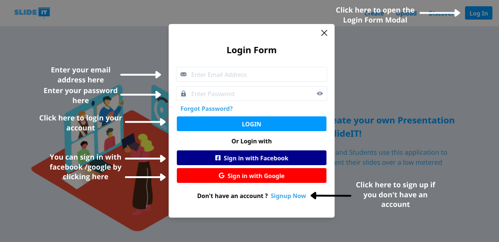
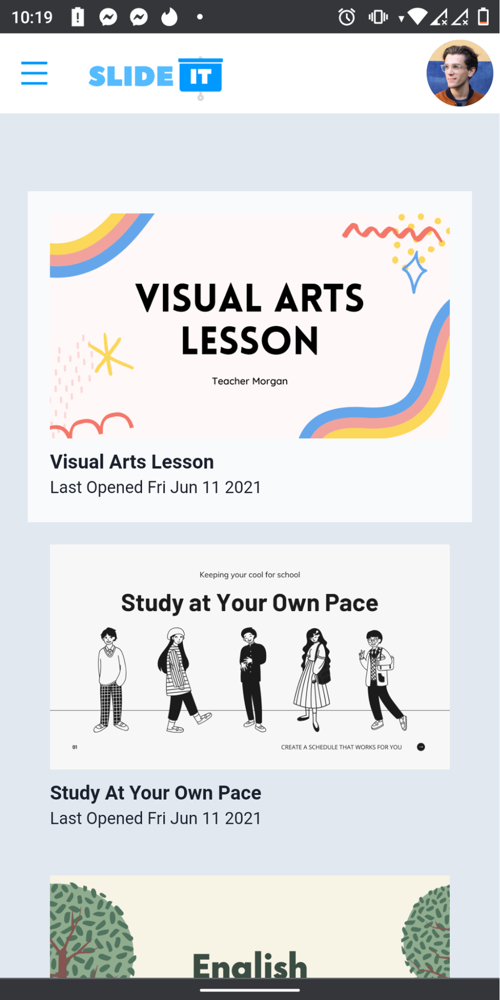

# SlideIt!
This repository is a final project for CMSC 173 - Human-Computer Interaction.

## Information

SlideIT!  is an web interactive slides prototype application which aims to create and present an interactive slide with a little consumption of internet data. It was created using ReactJS and deployed using netlify. The application can be accessed from this url: [SlideIT!](https://slideit.netlify.app/) 

## Functionalities

### Present Slides

Presenting slides can be accessed by two means, one is by clicking one of the slides in View All User Slides and two is by clicking the present in the Create Slides. Once it is done, the presenter will be redirected to the presenter view. In the presenter view, the presenter can copy the link to the presentation where the viewer can see current slides in real-time. After accessing the link, the app will ask the viewer for his/her name.

 
 
 

### View All User Slides

All of the slides that the presenter created will be shown in this view. It can be accessed in the landing page of the application once the user logs in or by clicking the logo of the SlideIT in the Navigation Bar anchored at the top.

 

### Create Slides

The presenter can create slides similar to how google slides are created. However, there are some additional features that you can add as a slide in your presentation to add some interactivity to the slides.

 

### Interactive Features

Interactive Features can be added up to the presentation slides using the toolbar at the right side in the Create Slides Section. These features can be interactively used by the participants/viewers once the presenter presents his/her slides . The features that can be added are as follows: TextBox, Image/File Input, Quiz, Question Management Tool, Poll and a Timed Quiz.

 

### Presenter Authentication

The users can sign in and sign up using their facebook account and google account however if they do not want to use those accounts, they can try to sign up using the sign up form. Once they are logged in, they are directed to their list of the slides they created. Users can log out their accounts and they will be redirected to the homepage.

 

### Discover

The users can see other live presentations in the Discover page that are set to public. 

 

### Upload

The users can also upload their pre-made presentations and present it using this functionality. 

 

### Presenter Settings

The users can also customize or tweak their accounts in the Accounts Settings that can be found in the menu once the user’s avatar in the navigation bar is clicked.

 

### Responsiveness

The application can be used in mobile devices since it was mobile responsive. However, to utilize the application’s full functionality, the users are encouraged to open the application on the desktop.

 
 